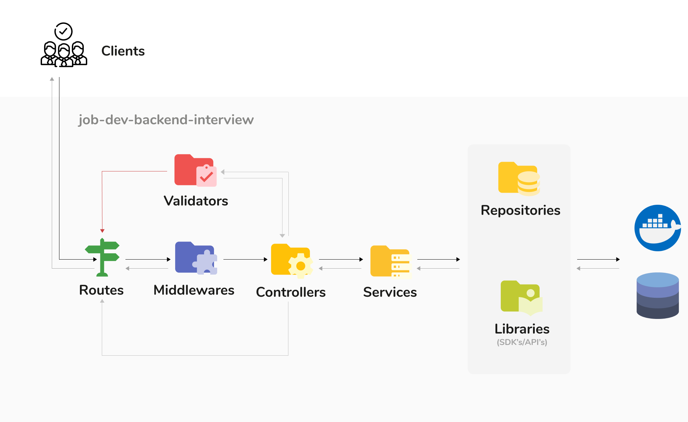
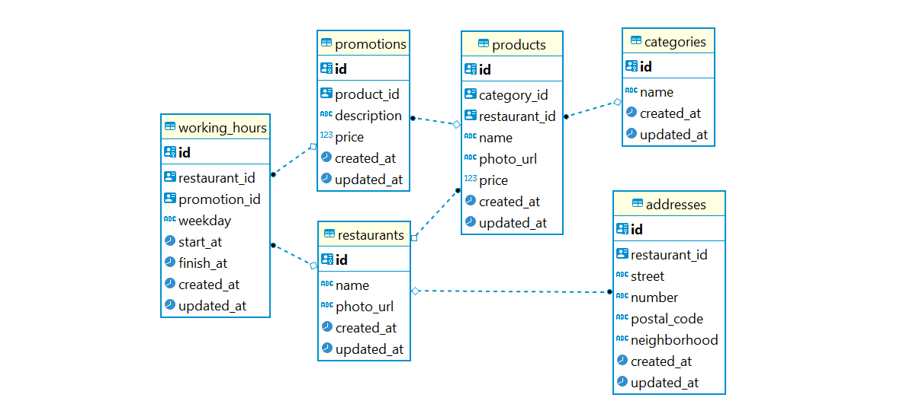
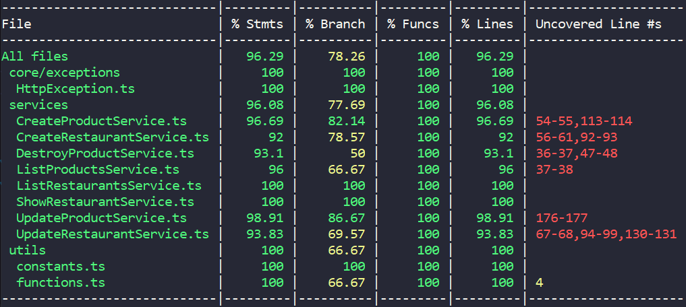

# Goomer backend challenge

## ✨ O Projeto
O projeto consiste em uma API para cadastro, alteração, listagens e exclusões de restaurantes e seus produtos, utilizando Node e Typescript.

Nesse README.md busquei trazer bastante argumentações sobre o porque utilizei essas ferramentas e técnicas no projeto.

Veja quais foram os [requisitos para esse desafio](https://github.com/goomerdev/job-dev-backend-interview).

## 📜 Manual de execução

Para rodar essa aplicação localmente você pode seguir uma das três opções descritas a seguir.

### Opção 1) Rodando com docker compose

Requisitos de ambiente:
- [Docker](https://www.docker.com/products/docker-desktop) versão 20.10.7 ou superior

Após instalar os pré-requisitos, na raiz do projeto você pode rodar o seguinte comando para subir a aplicação:

```shell
docker compose up development
```
> Aguarde o container subir e pronto, você já pode acessar a aplicação em: http://localhost:3333 😀

**Production Ready:** Se você deseja executar a versão built que vai rodar em produção, execute o comando `docker compose up production`

### Opção 2) Rodando manualmente

Requisitos de ambiente:
- [Node](https://nodejs.org/en/) versão 14.17.1 ou superior
- [Yarn](https://yarnpkg.com/) versão 1.22.10 ou superior

Primeiro, rode o comando `yarn` na raiz do projeto para instalar as dependências

Antes de continuar, precisaremos ter uma base de dados iniciada, pra isso você pode executar o comando `docker compose up goomerDatabase` ou fazer isso manualmente.

Se optar por subir uma base de dados manualmente certifique-se de ter as variáveis de ambiente sobre conexão com banco de dados configuradas, você pode renomear o arquivo .env.example para .env e adicionar os dados de acesso ao seu banco de dados.

Opcionalmente você pode subir uma instância do redis com o comando `docker compose up goomerRedis` ou instalar o redis na sua maquina manualmente, mas não se preocupe, pois caso a aplicação não consiga se conectar com o redis ela irá subir normalmente.

Agora você já pode executar a aplicação execute o comando `yarn dev`

> Aguarde a aplicação subir e pronto, você já pode acessar a aplicação em: http://localhost:3333 😀

**Production Ready:** Se você deseja executar a versão built que vai rodar em produção, execute o comando `yarn build` para gerar o código final e use o comando `yarn start` para servir a aplicação.

### Opção 3) Rodando com docker run

Requisitos de ambiente:
- [Docker](https://www.docker.com/products/docker-desktop) versão 20.10.7 ou superior

Essa é pra quem gosta de ativar o modo raiz nível 4 😅 ou pra quando houver alguma restrição à usar o compose. Mas se você só quer rodar local mesmo recomendo usar a opção 1.

Primeiro precisaremos fazer a build da imagem, pra isso rode:

```shell
docker build --file Dockerfile --tag backend --target back_development .
```

Opcionalmente você pode subir uma instância de redis com o seguinte comando:
```shell
docker run --name goomerRedis  -p 6379:6379 -d redis redis-server --bind '0.0.0.0'
```

> Caso você não suba essa instância a aplicação funcionará normalmente, porém sem os benefícios na velocidade da resposta da API com cache.

Agora vamos subir um container para a base de dados já especificando o arquivo DDL para ser executado:
```shell
docker run --name goomerDatabase -e POSTGRES_PASSWORD=postgres -v ${PWD}/docs/DDL-DML.sql:/docker-entrypoint-initdb.d/docker_postgres_init.sql -d postgres
```

E por fim, para subir o backend, na raiz do projeto execute:
```shell
docker run -it --rm -v ${PWD}:/app -v /app/node_modules -p 3333:3333 -e REDIS_HOST=host.docker.internal -e DATABASE_HOST=host.docker.internal -e NODE_ENV=development backend
```

> Espere os containers subirem e pronto, você já pode acessar a aplicação em: http://localhost:3333 😀


**Production Ready:** Se você deseja executar a versão built que vai rodar em produção, apenas troque o --target para `back_production` ao invés de `back_development` quando for gerar a imagem, o resto do processo é o mesmo.

## Referência da API

Eu geralmente gosto de documentar minhas API's na plataforma stoplight.io, então vou deixar aqui o [link pra acessar a referência da API online](https://qualtrics.stoplight.io/docs/gh/gabrieldissotti/job-dev-backend-interview).

Vou deixar esses links para que você possa baixar o [arquivo de collection para Postman](./docs/postman.collection.json) ou [o arquivo para Insomnia](./docs/insomnia.collection.json) para fazer as requests à API localmente caso deseje. Você pode importar esses arquivos no programa correspondente e já deixei alguns payloads prontos para você usar.

## Arquitetura do projeto

Em resumo, segue uma imagem exibindo o fluxo da requisição pelas camadas da aplicação:




A seguir será detalhado a responsabilidade de cada camada da aplicação.

### __tests__
Unidade onde criamos todos os arquivos de teste do projeto.

### @types
Para sobrescrever interfaces que já existem, como a Request do express, podem ser criados arquivos *.d.ts dentro dessa pasta.

### Configs
É a camada onde definimos tudo que é parametrizável da API, facilitando encontrar essas configurações caso seja necessário para manutenir a aplicação.

### Container
É onde estão as "referências" das classes para serem utilizadas na injeção de dependência nas services. Quando forem adicionadas novas classes com injeção de dependência, devem ser mapeadas aqui. Para injeção de dependência utilizamos a biblioteca tsyringe.

### Controllers
Camada de domínio que tem apenas a responsabilidade de receber a requisição, encaminhar para outra camada lidar e devolver a resposta para o cliente;

### Database
Camada responsável por fazer a conexão com o banco de dados.

### Entities
Camada onde ficam as entidades ou models, utilizadas pelas repositories para mapear as relações existentes.

### Exceptions
Camada onde são definidas as classes de exceções usadas no projeto para padronizar erros HTTP e outros erros internos.

### Libraries
São bibliotecas com o objetivo de isolar responsabilidades diferentes como exibir logs padronizados, consumir API's ou SDK's.

### Middlewares
São interceptadores de requisições, usados para abstrair lógicas que são úteis para a maioria dos fluxos de requisição.

### Repositories
Camada com a responsabilidade de manter toda a abstração de consultas ao banco de dados


### Services
Onde se encontra todas as regras de negócio. Segui os padrões do Service Pattern do Domain-driven Design (DDD) quando criei services com uma única função publica `execute()` com a finalidade de isolar responsabilidades.

### Utils
Pasta que contem as constantes, enums e funções comuns úteis para qualquer parte do projeto

### Validators
Camada com objetivo de validar os dados recebidos de um payload, query string ou path params para garantir a integridade das informações enviadas pelo cliente.

### Routes
Local onde definimos as rotas (paths) do domínio e referênciamos a qual controller devemos encaminhar a requisição.

## Banco de dados e modelagem

Dentre os 3 bancos SGBD's para SQL que já utilizei (Postgres, MariaDB/MySQL e SQL Server), eu optei em usar o Postgres porque:

- É um projeto Open Source, sendo assim gratuíto não sendo necessário arcar com custos de licença

- Tem uma comunidade bem grande, então para quase qualquer problema se encontra facilmente soluções em forums na internet.

- Suporta queries em paralelo que usam diferentes núcleos do processador

Sendo assim, esse foi a modelagem do projeto que elaborei com base no problema:




[Você pode ver o DDL clicando aqui](./docs/DDL-DML.sql)

## Outras decisões técnicas

- Optei por adicionar redis para fazer cache no endpoint de listagem de produtos e restaurantes, assim aumentando a performance e diminuindo o processamento do lado do servidor, se esse projeto fosse para produção usando um serviço de custo dinâmico como Lambda da AWS, teríamos uma redução de custos significativa no longo prazo, além de tornar a experiência do usuário final melhor por ter que esperar menos.
  - O cache está configurado para durar 1 minuto, porém isso seria algo parametrizável pela variável de ambiente `REDIS_CACHE_DURATION` e esse tempo seria decidido dependendo do cenário tivermos em ambiente de produção.
  - A chave do cache é uma string gerada combinado a rota e os query params
  - Quando a API responde com dados em cache, são adicionados os headers `cache_updated_at` e `cache_invalidation_at` para a aplicação cliente que possa se integrar saber quando esses dados foram atualizados.

- Optei por utilizar UUID's ao invés de números sequenciais porque essa é uma técnica que pode garantir um pouco mais segurança dado que seria mais difícil de descobrir os recursos da mesma natureza, são praticamente infinitos e é a melhor forma de identificar e relacionar e relacionar objetos dentre um grupo de API's ou bancos de dados distribuídos.

## Testes unitários

Para a maioria dos casos eu utilizei da prática TDD criando os testes antes de criar a funcionalidade.

- Para gerar cobertura de testes rode `yarn test --coverage`

**Cobertura de Testes**



## O que poderia melhorar

- Acredito que eu deveria ter salvo os horários de funcionamento como um campo string apenas, acho que compliquei demais sem necessidade, acredito que eu só precisaria ter feito dessa forma com validações de dias da semana e horários se meu objetivo fosse trabalhar com uma agenda ou algo assim, por outro lado se fosse apenas exibir como uma descrição em um app de delivery uma simples string seria mais interessante rs 😅.

- Eu poderia colocar algumas lógicas pra tornar aqueles arquivos de Mock das repositories em factories e ao adicionar alguns testes de integração usando a lib `supertest` pra fazer as requests e assim poder garantir o body que o endpoint estária retornando para o cliente.

- Eu poderia ter criado algumas funções privadas pra tornar a leitura da service mais fluída e isolando melhoras as responsabilidades, principalmente as services de update

## ⌛ Tempo decorrido para execução das tarefas

> Tempo levado para finalizar: 22h 46min

- Modelar banco de dados e gerar script de geração - 2h

- Configurar estrutura do projeto (pastas, database, redis, docker) - 2h 30min

- Cadastrar novos restaurantes - 2h 5min

- Alterar os dados um restaurante - 2h 6min

- Listar os dados de um restaurante - 1h 40min

- Adicionar horário de funcionamento em restaurantes - 2h

- Listar todos os restaurantes - 20min

- Excluir um restaurante - 51min

- Listar todos os produtos de um restaurante - 40min

- Criar um produto de um restaurante - 1h

- Alterar um produto de um restaurante - 1h 10min

- Excluir um produto de um restaurante - 25min

- Implementar melhorias e revisar código e documentação - 4h

- Atualizar Readme - 2h

## Considerações finais

Fico a disposição para tirar dúvidas e sempre estarei aberto a criticas construtivas e sugestões de melhorias, obrigado pela atenção!

Contato: gabrieldnrodrigues@gmail.com

Linkedin: https://www.linkedin.com/in/gabrieldissotti/

> Algumas pessoas com quem trabalhei recentemente comentaram no meu perfil do linkedin sobre a experiência que tiveram em trabalhar comigo, vale dar uma olhada lá 😀.
